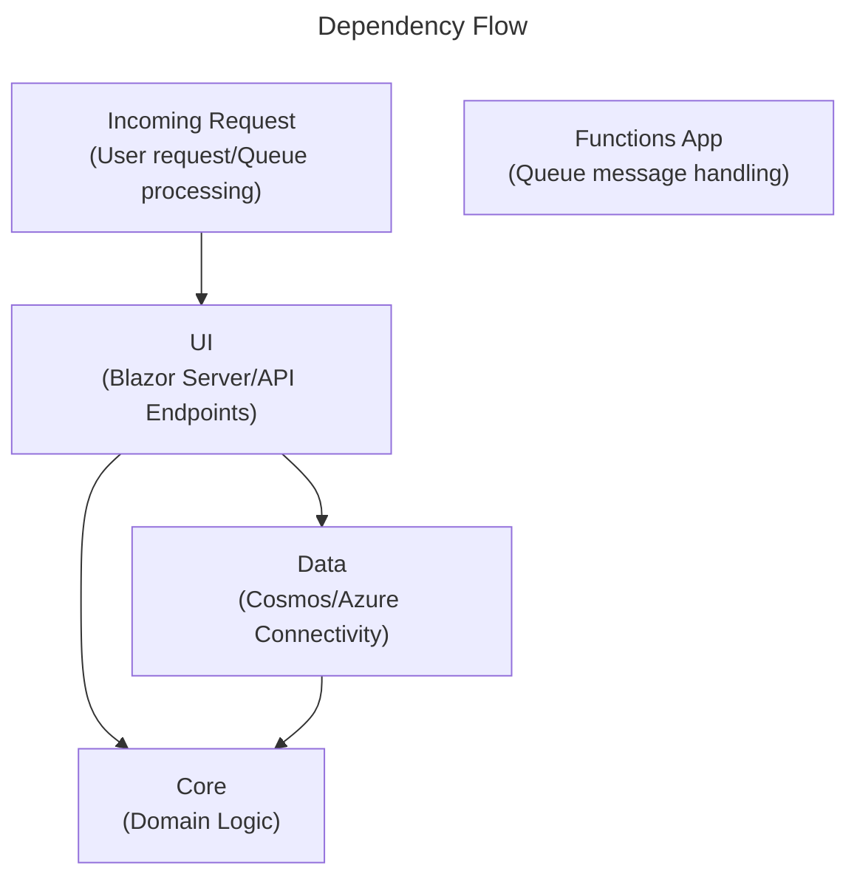

# Project Retrospective

I developed an app that leverages cloud infrastructure...and it was an emotional rollercoaster of pain when my head hit a wall, and excitement when I managed to get around it.

In an attempt to sharpen my skills, I figured it would be a good idea to expand and learn cloud technology in more detail. I would specifically learn more in Azure since, although light, it is the platform where all of my cloud experience currently lives. The goal was to create a somewhat basic app that would teach more than one piece of cloud tech, be easy to develop and run locally, and configure in the cloud without much pain.

## The Idea

After giving a prompt to ChatGPT for ideas, I settled on a URL shortening app, which I dubbed HalfLink. The application would allow a user to shorten a URL, provide redirecting from the HalfLink version of the original URL, and record basic click activity (in this case, the click's referrer.) The app would store links to a user's HalfLink stats page on-device using the browser's local storage API.

The tech stack was Cosmos DB, Azure Queues, Azure Functions, and Blazor Server. The local environment used Docker to run emulators for some Azure services, in particular Cosmos and Azurite (Azure Storage equivalent.) Cosmos, Queues, and Functions were all new to me, but I had a light amount of Blazor experience, so this was an opportunity to get more hands-on experience with it.

## Overall Application Structure

The solution was organized similar to a [clean architecture](https://learn.microsoft.com/en-us/dotnet/architecture/modern-web-apps-azure/common-web-application-architectures#clean-architecture) project, but incorporated some [locality of behavior](https://htmx.org/essays/locality-of-behaviour/) design as well. This meant that the project's code would be divided in terms of a primary focus - UI, infrastructure/external services, and the domain itself. Within these divisions, pieces of the code that relied on each other were typically co-located in some way - whether in a file together, or in the same location on the file system. Folders may be dedicated to a piece of code's technical concern, but it was not a guarantee.

A quick note on interfaces - I implemented a technique I've started to grow fond of where I do not create interfaces for the sake of an interface. In past projects, whether personal or professional, it was typical for many "service" classes to have an interface by default. It is a credible default because _"what if I need it down the road?"_ But as I have reflected on that I've found that many times this is not always the case. For this project, I relied on the idea that if a class didn't need an interface, it didn't get one. (Funnily enough, most classes in this project providing functionality _did_ require an interface.)

## Solution Setup

The main application contains four projects, described as follows:

- **UI** - The main Blazor Server website holding the webpages the user interacts with. This project also houses a couple of minimal API endpoints - one for accepting a HalfLink and redirecting to the original URL, and a second for receiving click activity and recording it in the DB.
- **Data** - Configuration and implementation of services that communicate outside of the application. Code that interacts with Cosmos and Azure services.
- **Core** - This is the domain logic, services, and all necessary contracts needed by the application to speak with external services.
- **Functions** - Technically part of the _Data_ layer, but still a separate project by nature. The Functions app is an isolated application reading from the Azure Queue and processing the message. The Functions app runs outside of the main application and doesn't depend on other parts of the application.

The primary flow of dependencies traveled from the UI and Data projects into Core. Although it was permissible for the UI to depend on the Data project, it tried to only do so for technical purposes - e.g. triggering the Data layer to register services used in Core.

### Testing

The solution contains a test suite that targets only the Core project. The primary class in core doing the orchestration between Core and Data is the `HalfLinkService`. Some mocking is done to verify interactions with data services, and a very light amount of stubbing is included to verify some code paths are calling external dependencies properly. I hadn't embraced mocks in quite some time so it was refreshing to give them another shot.

The testing strategy aims to target as close to 100% of the Core project as possible. Ideally the test suite targets all of the public methods of the `HalfLinkService` and will exercise them similarly to the UI code. If a public method isn't being tested, a test should be created to run it. However, there will be outliers, like record properties, where it doesn't make sense to directly try to target these. Such a test would essentially be testing that the CLR is doing its job....and that isn't a goal of testing. Therefore, whenever a line or block comes up as uncovered, it should be evaluated to see if it can be tested or ignored, and in the case of the latter, it should be marked with `[ExcludeFromCodeCoverage]` so that it can be ignored in future evaluations.

### Cosmos DB

This type of storage technology was completely different from other SQL or RDBMS tools I've worked with in the past. But I must say it wasn't too bad to work with either. Cosmos was easy to interact with due to the `Microsoft.Azure.Cosmos` package, which had familiar terminology. It had methods to create the DB and containers (analogous to tables) if they didn't already exist - something that I leveraged to do some defensive programming in case the app was being dropped into a new environment.

As I would learn, Cosmos (or at least Cosmos for NoSQL) stored "records" as JSON documents. This made the back and forth of domain entity to DB record very easy to understand. A big factor I learned about a Cosmos container was the _partition key_, an immutable property that serves as a mechanism for Cosmos to _physically_ store the record. Although not entirely a primary key, it certainly felt like it.

### Azure Queues and Azure Functions

Part of an Azure storage account, an Azure Queue is where click events are sent and eventually read. The main application was responsible for adding click events to the queue when a HalfLink was read and the user was redirected to the original URL. The Azure Functions app provided the reading of the queue and subsequent call into the main application to have the click recorded.

An interesting learn developing this feature was that the Function app could, once configured properly, wire itself into the queue and handle all the subscription to read from it.

Although these two pieces were new to me, the SDK methods were easy to understand and work with. Messages, for my purpose at least, were merely serialized JSON strings - which was already familiar to me from working with regular Web APIs.

## Wiring Services in the Local Environment

Getting everything up and running locally was by far easier than doing the equivalent in Azure, but it didn't come without its issues. Regardless of the environment, things like connection strings, or whether a managed identity would be used, would differ between local and cloud. App settings was the natural choice to manage this. Settings were defined and set up for local development, and then configured for override in Azure.

A goal for the Azure environment was to use a managed identity, but for local development, things were kept simple. Fortunately, both the [Azurite emulator](https://learn.microsoft.com/en-us/azure/storage/common/storage-install-azurite?tabs=docker-hub%2Cqueue-storage) and the [Cosmos emulator](https://learn.microsoft.com/en-us/azure/cosmos-db/how-to-develop-emulator?tabs=docker-linux%2Ccsharp&pivots=api-nosql) weren't too difficult to get set up in a Docker environment. Both emulators have predefined settings that can be used to get up and running locally. The Cosmos emulator needed an SSL certificate installed on my local machine, a step that the docs identify. Fortunately, that certificate lives directly in the container, so I only had to extract and install it. The Azurite emulator worked well as configured, but the container required a startup switch, `--skipApiVersionCheck`, to allow commands to be sent to it via the Azure CLI to suppress API version errors. The command line was helpful during the setup process to be able to peek at the queue to make sure messages were going in and out. (Although later I realized the console for the Functions app would show me this information.)

The Azure Functions app was a project of its own in the solution and was set to start up with the rest of the application. Originally, I had a Functions app running in a container before realizing this, so I was able to remove it from the Docker environment. I was pleased to see that the code for a Functions app was more familiar than I was expecting. I had a `Program` file where I could do configuration and inject services to the app. The app itself was a class with the `[Function]` attribute, and a method with a `[QueueTrigger]` attribute. This was enough for the Functions app to wire up to the Azure Queue and kick off my method whenever a new message was added to it. If processing failed, the message was placed back in the queue, and after a handful of errors, the message would be placed in a _poison_ queue for later inspection.

The Blazor application, following regular ASP.NET startup practices, is where the Cosmos and Queue clients would be set up using the relevant .NET SDKs for C#. The Blazor app itself (which was installed via a MudBlazor template) wouldn't require any additional setup, except setting the app to interactive server render mode....a flag that I'd forgotten to set when bringing the project in via the CLI. Since the Blazor app was going to store some data on-device with the local storage API, I had to get a little familiarity with the `IJSRuntime` interface, which is how I would call JS code on the client from my C# code.

Overall, there was a little bit of tinkering and resolving issues where I set things up incorrectly. But in the end, I could create a HalfLink, click it, and get redirected to the original URL. During redirection, a click event would be registered and added to the queue, and the Functions app would pick it up and feed it back to the main application through the appropriate endpoint.

Cue programmer happiness!

## Wiring Services in the Azure Environment

This is where the skill issues kicked in...

I mean that sincerely. Many of the issues I had, which I talk about below, can be boiled down to my unfamiliarity with Azure and how to configure services within it. Setting up services started off easy enough, but as I got into the thick of it the territory became more and more unfamiliar.

Going in mostly cold, I created a resource group to organize everything under in Azure and added an App Service for the Blazor app to run inside of. I took the time to set up my configuration variables for the Blazor app while I was there. Having set up an app service before, I didn't have any trouble getting it going. The UI was a little different, but of the three services, the App Service was by far the easiest to get going.

I moved on to the storage account for the queue. I didn't know this at first, but the Functions app would leverage the storage account too. Originally I set it up to not allow public access via its endpoints. This would turn out to be a source of pain since restricting access to the account needed some additional setup that I was unable to figure out how to properly configure. Whenever I'd start to create the Functions app, and select my storage account, I would be notified that the storage account would not be accessible by the Functions app. I tried playing around with the endpoints, and even a virtual network, but to no avail. After some time of failing, I would delete the storage account and let it be created as part of the process during the Functions app, relying on that process to configure it in a way where it would be accessible.

The Functions app was similar to the Blazor app in terms of setup. It did need access to the storage account for its own files (established without the headache of creating the account separately), and appeared to run on its own app service. One thing that I hadn't done, which caused issues later, was properly set up the configuration variables. I had a misunderstanding that the default settings found in my `local.settings.json` file were generally available once deployed. The file is itself ignored in the repository, but somewhere along the line I had convinced myself that these variables would be created during the publish process.

### Authentication

For Azure, I wanted to get some familiarity with managed identities. The identity would belong to the resource group so that the DB, Functions app, and Blazor app would all have access to the identity. The identity would have the necessary permissions to allow the clients for Cosmos, Queues, and Functions to all interact with each other. I configured these settings with RBAC.

It took a minute to understand what was being shown to me when I would go to a resource's access control settings. Assigning roles was straightforward, but I was confused when viewing who had access and I would see roles that belonged to different services. Later I realized that this had to do with assigning the identity to the resource group. So even though an identity and role had access to a resource, it didn't matter unless it had the _right_ role assigned.

### Getting the App to Start

At this point, the app had failed to start multiple times due to external clients not getting up and going. Both the Queue and the Cosmos DB were supposed to create the necessary resources on startup. The Queue was created, but the Cosmos DB was not. After some "additional troubleshooting" I discovered that the Cosmos client was not creating the DB.

This _additional troubleshooting_ came in the form of logs. I had no logging library (NLog, Serilog, etc.) included in the project, relying instead on the `ILogger` abstraction and sending logs to the console. However, finding these wasn't as obvious as I thought it would be. In the Blazor app there was a section for Log Stream under Monitoring in the resource itself. This did provide some logs, but it didn't seem to have all the logs in general. I would later learn that my App Service for the Blazor app had something called _Kudu_ installed, and this would have the logs I wanted to see. I had the same issue for the Functions app early on, but I didn't seem to have the same tools. Instead, I needed to use application insights...which was a whole set of (intimidating) metrics on its own. These helped a little, but it was very hard to find information. Honestly, application insights felt like being in the cockpit of an airplane without a pilot's license!

Both the Cosmos DB and the Functions app had some issues getting started. For the Functions app, there were other environment variables I needed to set to instruct the app to use the managed identity. Once these were in place, that portion started firing up properly. The Cosmos DB was a little more difficult to figure out, and it introduced me to two new terms: _control plane_ and _data plane_.

I did a good amount of review and searching about what I needed to add to my identity in RBAC to allow my app to create a Cosmos DB. I found an article that showed how to create a custom role that grants access, but it didn't resolve the issue. However, creating the database and containers manually alleviated the issue, but didn't explain why it was broken in the first place. The same code worked perfectly fine in the dev environment with the emulator. I would later understand that an Azure Cosmos DB makes a distinction between the _control plane_ (managing the resource itself), and the _data plane_ (the ability to do CRUD operations.) In dev, the Cosmos client could work with the emulator on both the control and data planes, but in Azure (at least for Cosmos), you need to use the [Azure Resource Manager (ARM) for Cosmos](https://learn.microsoft.com/en-us/dotnet/api/azure.resourcemanager.cosmosdb?view=azure-dotnet) to do the management of databases and containers. Admittedly, I did not implement this in my application. Manual creation of the things I needed was enough to let progress continue.

After resolving the authentication and connectivity issues in the overall architecture - everything started to work. Happy programmer noises had returned!

## AI as a Sidekick

From the beginning I knew I would place more reliance on AI to help learn some of the new tech I was aiming to implement, but AI would not be leading development. Instead, AI would be used to get my feet wet with the SDKs that would be needed and the basic configuration that would be involved. AI was very helpful in that regard and showed value early on setting things up in the dev environment. Getting everything working in Docker containers, with the app running locally was excellent, but the real value I got from AI came in the form of troubleshooting all the hurdles of taking this app up to Azure.

From the inception of this project I used a mixture of Claude and OpenAI models - Opus 4.6, Sonnet 4.6, GPT 5.4, and GPT 5.3-codex. These were all through GitHub Copilot in Visual Studio 2026 and VS Code. For each model, I wouldn't say any were bad, but they did perform better if my prompt was better. This is despite the fact that all of the models would sometimes give incorrect information as well. When troubleshooting or asking for clarifying information I would typically add additional context, which usually triggered the LLM to provide comparisons that helped me understand a library or SDK better. Specifying React vs. Blazor to understand component development or how Cosmos DB works compared to EF Core - this sort of framing let the LLM explain things in a way that helped me understand how these types of tech compare and contrast. When I wanted to know more from the source, the LLMs were usually good at giving me links to the docs where I could go read more.

The real difference showed up when I was having problems during the deployment to prod. As mentioned above, I had multiple issues getting things wired up in the Azure environment, and AI helped figure out where those problems were. It wasn't exactly easy though - I did need to explain a lot about the errors I was seeing and things I'd tried to fix the problems. This is where there was a bigger gap between the LLMs. GPT was very forthcoming with troubleshooting steps and explaining what errors I was seeing, but Claude approached problems by running commands with the Azure CLI to see what was in the prod environment, and even occasionally fixing them. Opus was slower and consumed requests at a noticeably higher rate, but on the harder debugging problems, it often had the edge.

Overall, I was happy with this use of AI to help solve problems and identify gaps in my own knowledge. Especially since the application is essentially going to be thrown away. I wanted to use AI as a sidekick, and a sidekick is what I got.

## The Good, The Bad, and What to do Different

The project was a success. The primary goals were all met. I got to learn and implement new tech with an actual app I could use in a hosted cloud environment that did all of the things I wanted it to do. This, all by itself, even with all of the issues, brought me immense joy.

For the problems, I didn't go straight to AI. I did try to leverage the documentation, but it was more of a reference than a tutorial. The docs have a lot of linking between different pages and it can be hard to tell if you are on the page that is going to help you solve your problem, or load your brain with knowledge you can't use at the moment.

My problems with all of this are much more than documentation, and more with initiative. I hold an [AZ-900 certification](https://learn.microsoft.com/api/credentials/share/en-us/JW-9715/B15A5AE538F49334?sharingId=4C4D036FF7B29E66) that I earned in 2021, and I had some limited use of Azure in my professional life since then, but I never went out of my way to actually utilize it - even in this kind of learning capacity. The cloud is a complex place, and it can be a challenge to get into, but it is also a _use it or lose it_ muscle. I could've helped myself by doing a project like this before letting years go by and letting what I had learned about Azure all those years ago wither away.

That said - you don't get the joy of the highs without the frustration of the lows. I like to think that if I had to do it all again, I would go refresh my Azure knowledge before setting out on this project, but I'm pretty sure that isn't true. I'm happy I got to the place I did through the path I took, and with the tools I used. As great of a teacher frustration (and failure) is, I think next time I'll take a more structured learning path to the features in Azure I want to leverage for my next cloud project.
